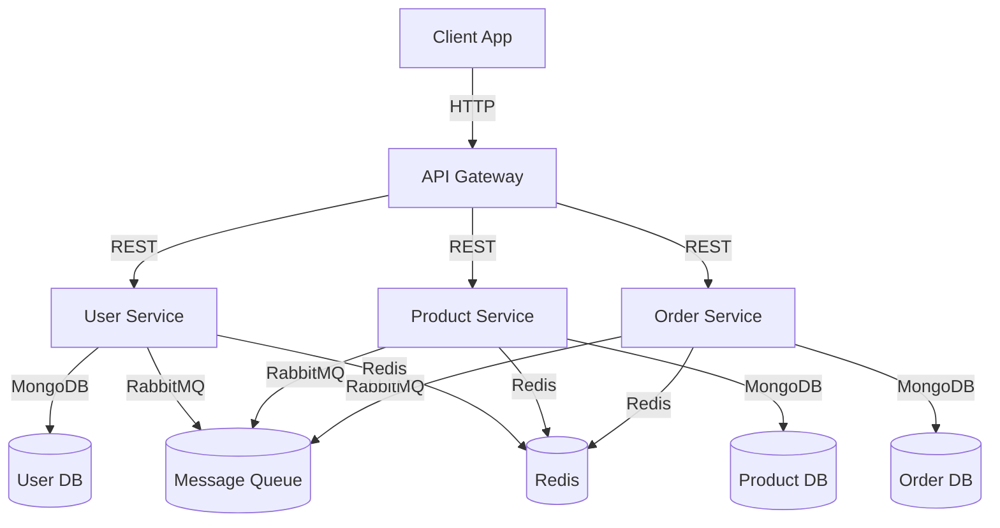

# 🛍️ STREETWEAR E-commerce Microservices Platform

<div align="center">


[](https://opensource.org/licenses/MIT)
[](http://makeapullrequest.com)

</div>

---

## 📑 Table of Contents
- [Project Overview](#project-overview)
- [Why This System Meets Modern Microservices Standards](#why-this-system-meets-modern-microservices-standards)
- [System Architecture](#system-architecture)
- [Tech Stack](#tech-stack)
- [Installation & Setup](#installation--setup)
- [Configuration](#configuration)
- [Service Details](#service-details)
- [Interface & Dependency Injection Example](#interface--dependency-injection-example)
- [API Documentation](#api-documentation)
- [Testing](#testing)
- [Security](#security)
- [Scaling & Operations](#scaling--operations)
- [Troubleshooting](#troubleshooting)
- [Authors](#authors)
- [License](#license)

---

## 🎯 Project Overview
A modern, scalable e-commerce platform built with microservices, clean architecture, and best practices. Designed for streetwear fashion, it is production-ready, secure, and easy to extend.

---

## ✅ Why This System Meets Modern Microservices Standards

**1. Domain Decomposition**: Each microservice is focused on a single business domain (User, Product, Order, Gateway).

**2. Communication**: Services communicate via REST APIs and asynchronous events (RabbitMQ-ready), with an API Gateway for unified access.

**3. Distributed Data Management**: Each service manages its own MongoDB database, ensuring data isolation and scalability.

**4. Deployment & Operation**: Fully containerized with Docker Compose, supports independent deployment, and externalized configuration via `.env` and `config.js`/`config.example.js`.

**5. Observability & Resilience**: Centralized logging (Winston), health checks, circuit breaker pattern, and retry logic for robust, observable services.

**Best Practices Implemented:**
- Interface-based architecture (see `user-service/interfaces/IUserRepository.js`)
- Dependency injection (repositories injected into controllers/services)
- Secrets/configuration via `.env` and `config.js` (never hardcoded)
- Clean, modular codebase

---

## 🗺️ System Architecture



---

## 🛠️ Tech Stack
- **Frontend**: React, Nginx
- **Backend**: Node.js, Express.js
- **Database**: MongoDB (per service)
- **API Gateway**: Express.js
- **Cache**: Redis
- **Message Queue**: RabbitMQ (optional, event-driven ready)
- **Containerization**: Docker, Docker Compose
- **Security**: JWT, bcrypt, CORS, rate limiting
- **Testing**: Jest, Supertest

---

## 🚀 Installation & Setup

### Prerequisites
- Docker (v20.10+)
- Docker Compose (v2.0+)
- Node.js (v16+)
- MongoDB Atlas or local instance
- Redis (optional, for caching)

### Steps
1. **Clone the repository:**
   ```bash
   git clone https://github.com/JustinGomezcoello/e-commerce.git
   cd e-commerce
   ```
2. **Copy and edit environment variables:**
   ```bash
   cp .env.example .env
   # Edit .env with your MongoDB URI, JWT secret, etc.
   ```
   - **Where to put credentials:**
     - MongoDB URI, usernames, passwords, JWT secrets, and other sensitive data go in `.env` (never commit this file).
     - Example:
       ```env
       MONGODB_URI=mongodb+srv://<user>:<password>@cluster.mongodb.net/ecommerce
       JWT_SECRET=your_jwt_secret
       ```
3. **Build and start all services:**
   ```bash
   docker-compose build
   docker-compose up -d
   ```
4. **Access the app:**
   - Frontend: http://localhost
   - API Gateway: http://localhost:8080

---

## ⚙️ Configuration
- **.env** (root): All secrets and connection strings
- **user-service/config/config.js**: Reads from `.env` for DB and JWT
- **product-service/config/**: Reads from `.env`
- **order-service/config/**: Reads from `.env`
- **Never commit real credentials! Use `.env.example` as a template.**

---

## 🧩 Service Details

### API Gateway
- Unified entry point, CORS, rate limiting, request routing

### User Service
- User registration, login, JWT auth, profile, repository pattern, DI, circuit breaker

### Product Service
- Product CRUD, inventory, image upload, caching

### Order Service
- Order creation, payment, status, event-driven ready

---

## 🧑‍💻 Interface & Dependency Injection Example

**Interface:**
```js
// user-service/interfaces/IUserRepository.js
class IUserRepository {
  findById(id) { throw new Error('Not implemented'); }
  save(user) { throw new Error('Not implemented'); }
}
module.exports = IUserRepository;
```

**Dependency Injection:**
```js
// user-service/controllers/userController.js
const IUserRepository = require('../interfaces/IUserRepository');
class UserController {
  constructor(userRepository) {
    if (!(userRepository instanceof IUserRepository)) throw new Error('Invalid repository');
    this.userRepository = userRepository;
  }
  // ...
}
```

**Config Example:**
```js
// user-service/config/config.js
module.exports = {
  database: { url: process.env.MONGODB_URI },
  jwt: { secret: process.env.JWT_SECRET }
};
```

---

## 📚 API Documentation
- **Swagger UI:** http://localhost:8080/api-docs
- **OpenAPI Spec:** http://localhost:8080/api-docs.json

---

## 🧪 Testing
```bash
# Run all tests
docker-compose run --rm user-service npm test
# Or for a specific service
docker-compose run --rm product-service npm test
```

---

## 🔒 Security
- JWT authentication, RBAC
- Password hashing (bcrypt)
- CORS, rate limiting, helmet
- Secrets in `.env` only
- Input validation everywhere

---

## 📈 Scaling & Operations
- **Horizontal scaling:**
  ```bash
  docker-compose up -d --scale user-service=3
  ```
- **Load balancing:** Nginx config included
- **Health checks:** `/health` endpoints
- **Centralized logging:** Winston, log files per service

---

## 🐛 Troubleshooting
- **Check logs:**
  ```bash
  docker-compose logs user-service
  docker-compose logs api-gateway
  ```
- **Check health:**
  ```bash
  curl http://localhost:8080/health
  ```
- **Common issues:**
  - Wrong credentials in `.env`
  - MongoDB Atlas IP whitelist
  - Ports in use

---

## 👥 Authors
- **Jhoel Suarez**
- **Justin Gomezcoello**

---

## 📄 License
This project is licensed under the MIT License - see the [LICENSE](LICENSE) file for details.
