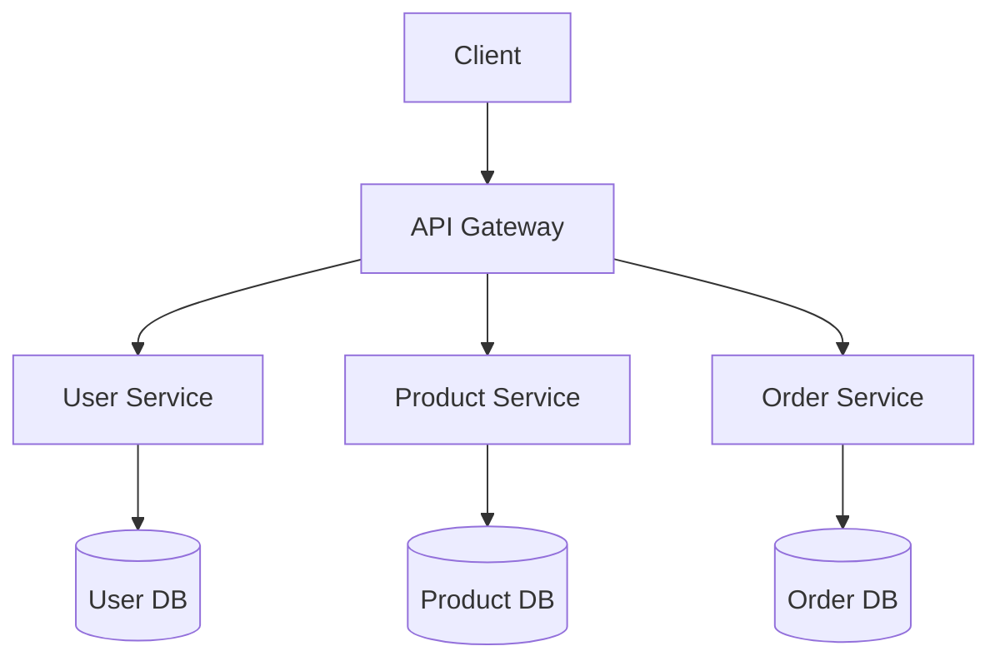

# 🛍️ STREETWEAR E-commerce Microservices Platform

A modern, scalable e-commerce platform built using microservices architecture, specifically designed for streetwear fashion retail. This platform demonstrates the implementation of clean architecture and microservices best practices.

## Authors
- Jhoel Suarez
- Justin Gomezcoello

## 🎯 Microservices Architecture Implementation

### 1. Domain Decomposition
Our platform is decomposed into four main bounded contexts:
- **User Domain**: Authentication, authorization, and user management
- **Product Domain**: Product catalog and inventory management
- **Order Domain**: Order processing and payment handling
- **API Gateway**: Request routing and client communication



### 2. Inter-Service Communication
- **Event-Driven Architecture**: Asynchronous communication between services
- **REST APIs**: Synchronous communication for critical operations
- **Circuit Breaker Pattern**: Implemented using custom circuit breaker (`services/circuitBreaker.js`)

### 3. Distributed Data Management
- **Database per Service**: Each microservice has its own MongoDB instance
- **Eventually Consistent**: Using event-based synchronization
- **CQRS Pattern**: Separate read and write operations for better scalability

### 4. Deployment and Operations
- **Containerization**: Docker-based deployment
- **Service Discovery**: Through Docker networks
- **Configuration Management**: External configuration using environment variables

### 5. Observability and Resilience
- **Logging**: Centralized logging system using Winston
- **Health Checks**: Implemented in each service
- **Circuit Breakers**: Prevent cascade failures
- **Retry Policies**: Automatic retry for failed operations

## 🏗️ Clean Architecture Implementation

### Interface Segregation
```typescript
// Example from user-service/interfaces/IUserRepository.js
interface IUserRepository {
    findById(id: string): Promise<User>;
    save(user: User): Promise<void>;
    // ...other methods
}
```

### Dependency Injection
- Constructor-based DI in services
- Repository pattern implementation
- Configurable data sources

## 🚀 Getting Started

### Prerequisites
- Docker (v20.10+)
- Docker Compose (v2.0+)
- Node.js (v16+) for local development

### Configuration

1. Clone the repository:
```bash
git clone https://github.com/[your-username]/streetwear-ecommerce
cd streetwear-ecommerce
```

2. Create configuration files:

Create `.env` file in the root directory:
```env
# MongoDB Credentials
MONGO_ROOT_USERNAME=your_username
MONGO_ROOT_PASSWORD=your_secure_password
MONGO_HOST=mongodb
MONGO_PORT=27017

# JWT Configuration
JWT_SECRET=your_jwt_secret_key
JWT_EXPIRATION=24h

# API Gateway Configuration
API_GATEWAY_PORT=8080
CORS_ORIGIN=http://localhost:80

# Service Ports
USER_SERVICE_PORT=3001
PRODUCT_SERVICE_PORT=3002
ORDER_SERVICE_PORT=3003
```

3. Configure MongoDB (create `mongod.conf`):
```yaml
storage:
  dbPath: /data/db
security:
  authorization: enabled
net:
  port: 27017
  bindIp: 0.0.0.0
```

### Installation & Deployment

1. Build the services:
```bash
docker-compose build
```

2. Start the platform:
```bash
docker-compose up -d
```

3. Verify deployment:
```bash
docker-compose ps
```

## 🔍 Service Architecture

### API Gateway (Port 8080)
- Request routing
- Authentication middleware
- Rate limiting
- CORS configuration

### User Service (Port 3001)
- Authentication & Authorization
- User profile management
- Interface-based repository pattern
- JWT token handling

### Product Service (Port 3002)
- Product catalog management
- Inventory tracking
- Category management
- Image handling

### Order Service (Port 3003)
- Order processing
- Payment integration
- Order status tracking
- Event-driven updates

## 💾 Data Model

### User Schema
```javascript
{
  id: ObjectId,
  username: String,
  email: String,
  password: String (hashed),
  role: String,
  createdAt: Date
}
```

### Product Schema
```javascript
{
  id: ObjectId,
  name: String,
  description: String,
  price: Number,
  stock: Number,
  category: String,
  images: [String]
}
```

### Order Schema
```javascript
{
  id: ObjectId,
  userId: ObjectId,
  products: [{
    productId: ObjectId,
    quantity: Number,
    price: Number
  }],
  status: String,
  totalAmount: Number,
  createdAt: Date
}
```

## 🔒 Security

### Authentication
- JWT-based authentication
- Role-based access control
- Password hashing using bcrypt

### Data Protection
- Environment variables for secrets
- Encrypted communication
- Input validation and sanitization

## 🔧 Development

### Running Tests
```bash
# Run all tests
docker-compose run --rm user-service npm test

# Run specific service tests
docker-compose run --rm product-service npm test
```

### Logging
All services use Winston for logging:
- Info logs: `logs/combined.log`
- Error logs: `logs/error.log`

### Monitoring
Health check endpoints:
- Gateway: `GET /health`
- Services: `GET /api/health`

## 📈 Scaling

### Horizontal Scaling
```bash
docker-compose up -d --scale user-service=3
```

### Load Balancing
- Nginx load balancer configuration
- Round-robin algorithm
- Health check-based routing

## 🐛 Troubleshooting

### Common Issues
1. Connection Refused
```bash
docker-compose logs api-gateway
```

2. Database Connectivity
```bash
docker-compose logs mongodb
```

### Health Checks
```bash
curl http://localhost:8080/health
```

## 📚 API Documentation

Swagger documentation available at:
- `http://localhost:8080/api-docs`

## 📄 License

This project is licensed under the MIT License - see the [LICENSE](LICENSE) file for details.
