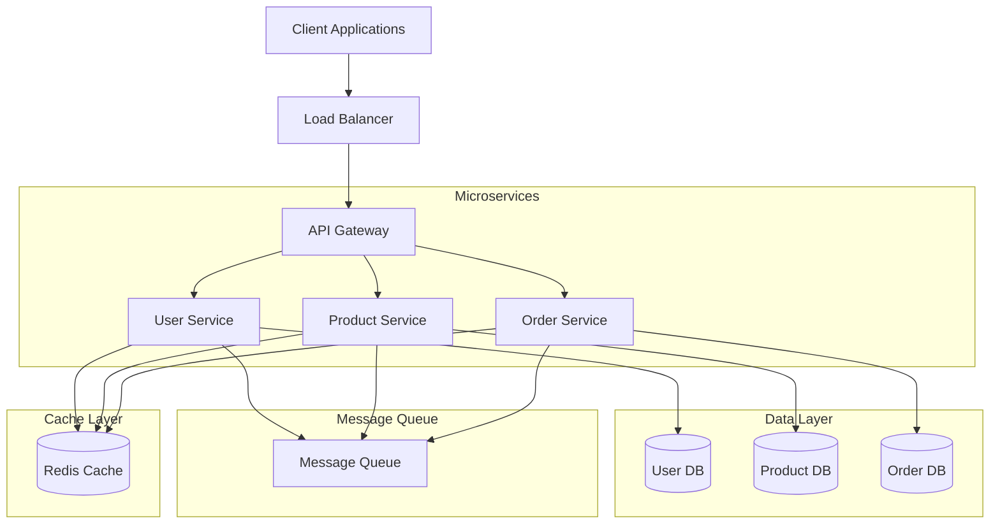

# 🛍️ STREETWEAR E-commerce Microservices Platform

<div align="center">


[](https://opensource.org/licenses/MIT)
[](http://makeapullrequest.com)

</div>

## 🎯 Project Overview

A modern, scalable e-commerce platform built using microservices architecture, specifically designed for streetwear fashion retail. This platform demonstrates the implementation of clean architecture and microservices best practices.

## ⭐ Key Features

- 🚀 **Microservices Architecture**: Independent, scalable services
- 🔒 **Secure Authentication**: JWT-based authentication system
- 📦 **Product Management**: Comprehensive catalog and inventory system
- 💳 **Order Processing**: Robust order and payment handling
- 📊 **Real-time Analytics**: Business intelligence and reporting
- 🔄 **Event-Driven**: Asynchronous communication between services
- 🛡️ **Fault Tolerance**: Circuit breakers and retry mechanisms
- 📱 **Responsive Design**: Mobile-first approach

## 🏆 Architecture Compliance

### 1. Domain-Driven Microservices
- **Independent Services**: Each service focuses on a single business domain
- **Bounded Contexts**: Clear separation of concerns
- **Domain Models**: Rich domain models with business logic
- **Service Autonomy**: Independent deployment and scaling

### 2. Communication Patterns
- **REST APIs**: Synchronous communication
- **Message Queues**: Asynchronous event handling
- **API Gateway**: Unified entry point
- **Service Discovery**: Dynamic service location

### 3. Distributed Data Management
- **Database per Service**: Isolated data storage
- **Event Sourcing**: Reliable event tracking
- **CQRS**: Optimized read/write operations
- **Eventual Consistency**: Message-based synchronization

### 4. Deployment & Operations
- **Containerization**: Docker-based deployment
- **Orchestration**: Docker Compose management
- **CI/CD**: Automated deployment pipeline
- **Configuration Management**: Externalized configuration

### 5. Observability & Resilience
- **Health Monitoring**: Service health checks
- **Logging**: Centralized logging system
- **Metrics**: Performance monitoring
- **Tracing**: Distributed request tracking

## 🏗️ System Architecture



## 🚀 Getting Started

### Prerequisites
- Docker (v20.10+)
- Docker Compose (v2.0+)
- Node.js (v16+)
- MongoDB (v5.0+)
- Redis (v6.0+)

### Quick Start

1. Clone the repository:
```bash
git clone https://github.com/[your-username]/streetwear-ecommerce
cd streetwear-ecommerce
```

2. Configure environment variables:
```bash
cp .env.example .env
# Edit .env with your configuration
```

3. Start the platform:
```bash
docker-compose up -d
```

4. Access the application:
- Frontend: http://localhost:3000
- API Gateway: http://localhost:8080
- Swagger Docs: http://localhost:8080/api-docs

## 🔧 Configuration

### Environment Variables
Create a `.env` file in the root directory:

```env
# MongoDB Credentials
MONGO_ROOT_USERNAME=your_username
MONGO_ROOT_PASSWORD=your_secure_password
MONGO_HOST=mongodb
MONGO_PORT=27017

# JWT Configuration
JWT_SECRET=your_jwt_secret_key
JWT_EXPIRATION=24h

# API Gateway Configuration
API_GATEWAY_PORT=8080
CORS_ORIGIN=http://localhost:80

# Service Ports
USER_SERVICE_PORT=3001
PRODUCT_SERVICE_PORT=3002
ORDER_SERVICE_PORT=3003

# Redis Configuration
REDIS_HOST=redis
REDIS_PORT=6379
REDIS_PASSWORD=your_redis_password

# Message Queue Configuration
RABBITMQ_HOST=rabbitmq
RABBITMQ_PORT=5672
RABBITMQ_USER=your_rabbitmq_user
RABBITMQ_PASSWORD=your_rabbitmq_password
```

## 📚 Documentation

### API Documentation
- Swagger UI: http://localhost:8080/api-docs
- OpenAPI Specification: http://localhost:8080/api-docs.json

### Architecture Documentation
- [System Architecture](docs/architecture.md)
- [Database Schema](docs/database.md)
- [API Reference](docs/api.md)
- [Deployment Guide](docs/deployment.md)

## 🧪 Testing

```bash
# Run all tests
npm test

# Run specific service tests
npm test -- --service=user
npm test -- --service=product
npm test -- --service=order
```

## 📈 Monitoring

### Health Checks
- API Gateway: `GET /health`
- Services: `GET /api/health`

### Logging
- Log files: `logs/combined.log`
- Error logs: `logs/error.log`

## 🔒 Security

- JWT-based authentication
- Role-based access control
- Password hashing with bcrypt
- HTTPS/TLS encryption
- Input validation and sanitization
- Rate limiting
- CORS configuration

## 🤝 Contributing

1. Fork the repository
2. Create your feature branch (`git checkout -b feature/AmazingFeature`)
3. Commit your changes (`git commit -m 'Add some AmazingFeature'`)
4. Push to the branch (`git push origin feature/AmazingFeature`)
5. Open a Pull Request

## 📄 License

This project is licensed under the MIT License - see the [LICENSE](LICENSE) file for details.

## 👥 Authors

- **Jhoel Suarez** - *Developer*
- **Justin Gomezcoello** - *Developer*

## 🙏 Acknowledgments

- [Node.js](https://nodejs.org/)
- [Express](https://expressjs.com/)
- [MongoDB](https://www.mongodb.com/)
- [Docker](https://www.docker.com/)
- [React](https://reactjs.org/)
- [TypeScript](https://www.typescriptlang.org/)
